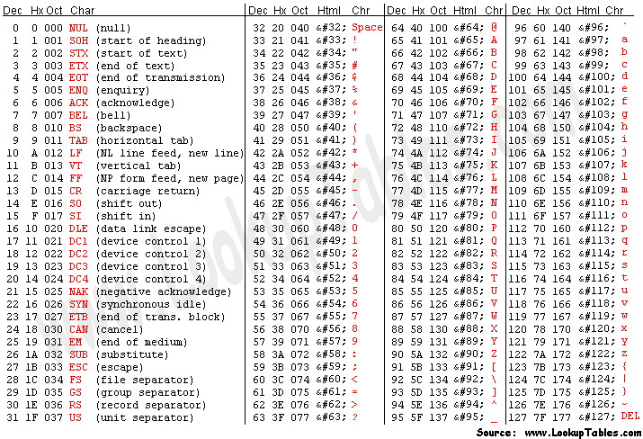

# CrackMe Q1

q1.exeの問題の解き方についての説明

[ソースコード](./../src/q1.c)

## 解説


まず、逆アセンブルされたコードを見る.

注目すべきは次の行

```asm
0040161 | E8 DB0F0000             | call <JMP.&strcmp>                         |
```

この行を見ると、C言語のライブラリであるstrcmp関数が使用されている
この関数は文字列の比較をする関数で、一致するときに0を出力する

次にこの関数の呼び出しの直前に注目してみると
```asm
0040160 | 8D4424 1A               | lea eax,dword ptr ss:[esp+1A]              |
0040160 | 894424 04               | mov dword ptr ss:[esp+4],eax               |
0040160 | 8D4424 21               | lea eax,dword ptr ss:[esp+21]              |
0040161 | 890424                  | mov dword ptr ss:[esp],eax                 |
```

とある。ここで注目してほしいのは2回ロードが行われている点である。
一回目のロードでは、`esp+1A`アドレスから、二回目は`esp+21`アドレスからである。

次にこの前のコードを見ると、
```asm
004015F | 8D4424 21               | lea eax,dword ptr ss:[esp+21]              |
004015F | 894424 04               | mov dword ptr ss:[esp+4],eax               |
004015F | C70424 59404000         | mov dword ptr ss:[esp],q1.404059           | 404059:"%254s"
0040160 | E8 FF0F0000             | call <JMP.&scanf>                          |
```

とある。ここでC言語の`scanf関数`が呼び出されている。この関数は特定のアドレスにデータを代入する関数で、
第一引数にフォーマット(`%d`など)を受け取り、第二引数に入力バッファのアドレスを受け取る

ここでは、上から
`eax`に`esp+21`のアドレスをロードして、
`eax`に格納されたアドレスを`esp+4`に移動して、フォーマット指定子`%254s`のアドレスを`esp`に移動している。

つまり、`esp+21`には入力された文字列のデータが格納されている。

ということは、パスワードが格納されているのは`esp+1A`アドレスである。`esp+1A`アドレスについて書かれてあるコードまで遡ると次のようなコードを見つけることができる。

```asm
004015D | C74424 1A 6B657931      | mov dword ptr ss:[esp+1A],3179656B         |
004015D | 66:C74424 1E 3233       | mov word ptr ss:[esp+1E],3332              |
004015E | C64424 20 00            | mov byte ptr ss:[esp+20],0                 |
```

ここでは、`esp+1A`アドレスに`3179656B`を移動し、`esp+1E`に`3332`を移動させ、`esp+20`に`0`を移動させている。

ここでいう、それぞれの16進数のコードはASCIIに対応しており、

>引用: アスキーテーブル<https://www.asciitable.com/>

それぞれ
`esp+1A`アドレスには`key1`、`esp+1E`には`32`が入り、`esp+20`にはヌル文字が入っている。

つまり、スタック上には実際に"key123"という文字列が`esp+1A`を起点として連続して配置されていることがわかる。

つまり、パスワードは`key123`であると分かる。